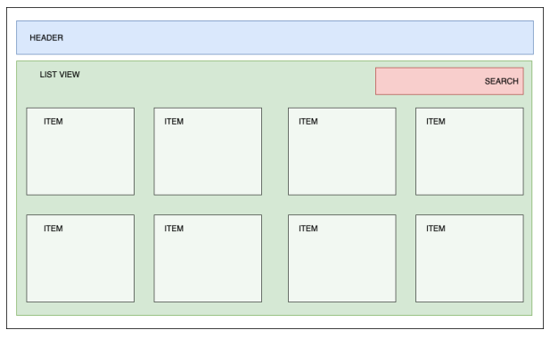
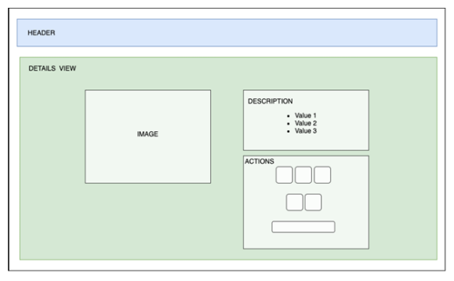

- [GO BACK](./../../README.md)

# ITX - EXAMEN FRONT END - RESUMEN

Esta prueba consiste en la creación de una miniaplicación para comprar dispositivos móviles.

- La aplicación tendrá únicamente dos vistas:
    1. Vista principal - Listado de productos
    2. Detalles del producto

- La implementación de los diseños queda a libre elección, pero deberá seguir la estructura que se ha definido en las capturas. Se valorará positivamente el nivel de detalle de la propuesta.

- Se requiere la utilización de React para el desarrollo de aplicación y se podrá complementar con otras librerías JS si se estima oportuno.

- Se permite la utilización de JS con ES6.

- Se podrá utilizar un boilerplate template para la creación de la estructura del proyecto.

- La aplicación será una SPA, donde se añadirá el enrutado de la vista del código de cliente, sin que sea una MPA o la utilización de SSR.

- El proyecto tendrá que contener el siguiente script, para poder gestionar la aplicación:
    1. START - Modo desarrollo.
    2. BUILD - Compilación para modo Producción.
    3. TEST - Lanzamiento de test.
    4. LINT - Comprobación de código.

- El proyecto deberá presentarse en un repositorio de código abierto (Github, Gitlab, Bitbucket), con la solución al problema. Se quiere que se pueda subir el código de manera evolutiva de manera que se vaya alcanzando hitos.

- En el repositorio hay que incluir un documento README (preferiblemente incluirlo en el primer commit), donde se incluirá la explicación para ejecutar el proyecto, así como alguna nota explicativa o información adicional que se considere necesaria.

## DESCRIPCIÓN DE LAS VISTAS

### PLP - Product List Page

- Página donde se visualizará la lista de los productos.

- En esta página, se mostrarán todos los elementos que nos devuelve la petición del API.

- Permitirá el filtrado del contenido en función del criterio de búsqueda que el usuario introduzca.

- Al seleccionar un producto, deberá navegar a los detalles del mismo.

- Se mostrarán un máximo de cuatro elementos por fila, y que sea adaptativo según la resolución.

<div style="with:100%;height:auto;text-align:center;">
    
</div>

### PDP - Product Details Page

- Esta página se dividirá en dos columnas:
    1. En la primera se mostrará el componente de la imagen del producto.
    2. En la segunda, se mostrará los detalles y las acciones del producto.

- Deberá mostrar un link para navegar de vuelta a la lista de productos.

<div style="with:100%;height:auto;text-align:center;">
    
</div>

## DESCRIPCIÓN DE LOS COMPONENTES

### Cabecera (HEADER)

- El título o el icono de la aplicación, actuará como enlace a la vista principal.

- Se mostrará un breadcrumbs, mostrando la página donde se encuentra el usuario, así como un link para su navegación.

- En la parte derecha de la cabecera, se mostrará el número de ítems que se hayan añadido al carrito.

### Barra de búsqueda (SEARCH)

- Se mostrará un input al usuario, el permitirá la introducción de una cadena de texto.

- El usuario deberá filtrar los productos en función del texto introducido, y se comparará con la Marca y el Modelo de los productos.

- El filtrado, será en tiempo real, es decir, se lanzará una búsqueda cada vez que el usuario cambie los criterios de búsqueda.

### Elemento lista (ITEM)

- Se mostrará la siguiente información del producto:
    1. Imagen
    2. Marca
    3. Modelo
    4. Precio

### Imagen Producto (IMAGE)

- Se visualizará la imagen del producto

### Descripción Producto (DESCRIPTION)

- Se mostrará los detalles asociados a los productos. Se mostrarán al menos los siguientes atributos:
    1. Marca
    2. Modelo
    3. Precio
    4. CPU
    5. RAM
    6. Sistema Operativo
    7. Resolución de pantalla
    8. Batería
    9. Cámaras
    10. Dimensiones
    11. Peso

### Acciones Producto (ACTIONS)

- Se mostrarán dos tipos de selectores, donde el usuario, podrá seleccionar el tipo de producto que quiere añadir a la cesta. Se mostrarán los selectores de opciones para los siguientes atributos:
    1. Almacenamiento
    2. Colores

- Aunque solo exista una opción, se mostrará el selector con la información. Para este caso de uso, deberá estar seleccionado por defecto.

- Se visualizará un botón de Añadir, donde el usuario, una vez seleccionada las opciones, añadirá el producto a la cesta.

- Al añadir un producto mediante el API, se requiere mandar la siguiente información:
    1. El identificador del producto.
    2. El código de color seleccionado.
    3. El código de la capacidad de almacenamiento seleccionada.

- La petición de añadir devuelve en la respuesta el número de productos que hay en la cesta. Este valor deberá mostrarse en la cabecera de la aplicación en cualquier vista de la misma. Para ello se requiere persistir el dato.

## RECURSOS

### Integración API

Para poder realizar la prueba, se requiere integrar con un API para la gestión de los datos.

El dominio del API será el mismo para todos los Endpoints, y será el siguiente: https://itx-frontend-test.onrender.com/

Las definiciones de los Endpoints son los siguientes:

- Obtener el listado de productos

    Path
    ```
    GET /api/product
    ```
    Response
    ```
    [
        {
            id: 0001,
            ...
        },
        {
            id: 0002,
            ...
        }
    ]
    ```

- Obtener el Detalle de producto

    Path
    ```
    GET /api/product
    ```
    Response
    ```
    [
        {
            id: 0001,
            ...
        },
        {
            id: 0002,
            ...
        }
    ]
    ```

- Añadir producto a la cesta
    Path
    ```
    GET /api/product
    ```
    Body
    ```
    {
        id: 0001,
        colorCode: 1,
        storageCode: 2
    }
    ```
    Response
    ```
    [
        {
            id: 0001,
            ...
        },
        {
            id: 0002,
            ...
        }
    ]
    ```

## Persistencia de datos

Se requiere, añadir un almacenaje en cliente de los datos que se reciban desde el API.

Lo que se quiere ofrecer es un sistema de cacheo, para no se realicen cada vez peticiones al API. Por ellos, se requiere definir la siguiente funcionalidad:

- Se almacenará la información cada vez que se solicite al servicio del API.

- Se guardará dicha información, y tendrá una expiración de 1 hora, una vez excedido dicho tiempo, deberá revalidarse la información.

- Se podrá utilizar cualquier método de storage para almacenar dicha información, ya sea del navegador o en memoria, pero siempre en cliente.